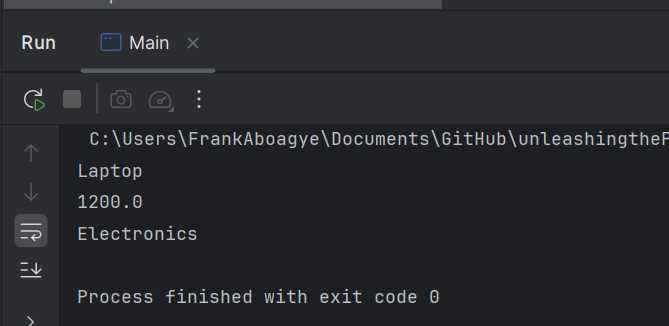
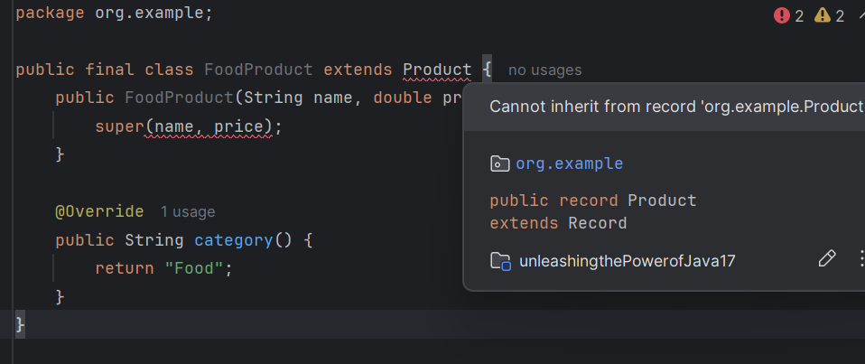

# Records
- A Record is a special type of class introduced in Java 14 
- (finalized in Java 16) designed to model immutable data. 
- Records automatically:
  - Generate a constructor 
  - Provide getters (called accessors)
  - Implement equals(), hashCode(), and toString()

### Managing product info in an online store
- a record called Product
[](./src/main/java/org/example/Product.java)
- so what happens under the hood - 🤔
- jaba does something like this
```java

public final class Product {
    private final String name;
    private final double price;
    private final String category;

    public Product(String name, double price, String category) { ... }

    public String name() { return name; }
    public double price() { return price; }
    public String category() { return category; }

    public boolean equals(Object o) { ... }
    public int hashCode() { ... }
    public String toString() { ... }
}

```

- using it 

```java
 public static void main(String[] args) {

        Product laptop = new Product("Laptop", 1200.0, "Electronics");

        System.out.println(laptop.name()); 
        System.out.println(laptop.price()); 
        System.out.println(laptop.category());
        
        /*
                These are accessors, 
                not getName() — records use field names 
                directly as method names.
         */

}

```

- output


# Sealed Classes
- Enforce strict control over class hierarchies. 
- Help you define what is allowed to extend a class.

### Sealing the Product Hierarchy
- the sealed base class
[](./src/main/java/org/example/SealedProduct.java)

- permitted subclasses
[./src/main/java/org/example/ElectronicsProduct.java](./src/main/java/org/example/ElectronicsProduct.java)
[./src/main/java/org/example/SealedProduct.java](./src/main/java/org/example/SealedProduct.java)

- so what is happening here? 
  - Only ElectronicsProduct and ClothingProduct are allowed because of the permits clause.
- so something like a FoodProduct would not work



# Switch Expressions and Text Blocks
- Switch Expressions
  - allows for returning a value from a switch — safer and more concise.
  - No need for break
[./src/main/java/org/example/Main.java](./src/main/java/org/example/Main.java)

- Text Blocks
  - Automatically handles indentation and new lines. 
  - Useful for HTML, JSON, multi-line strings.